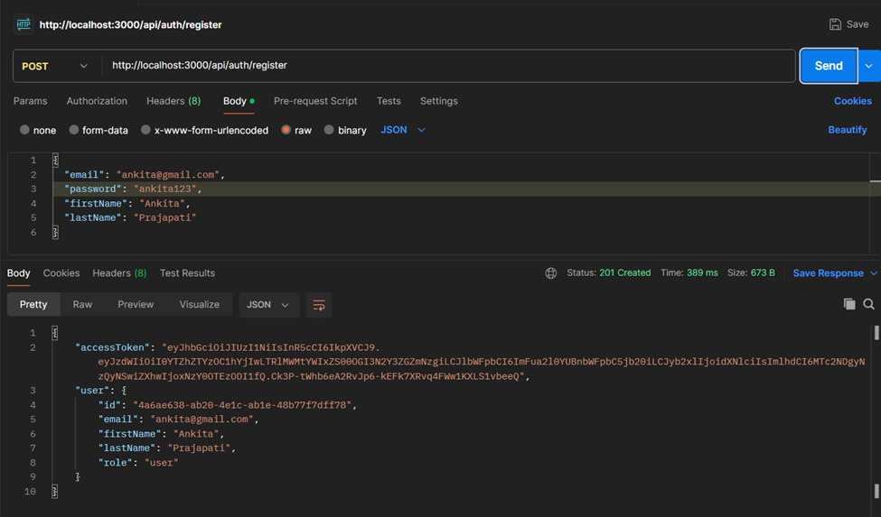
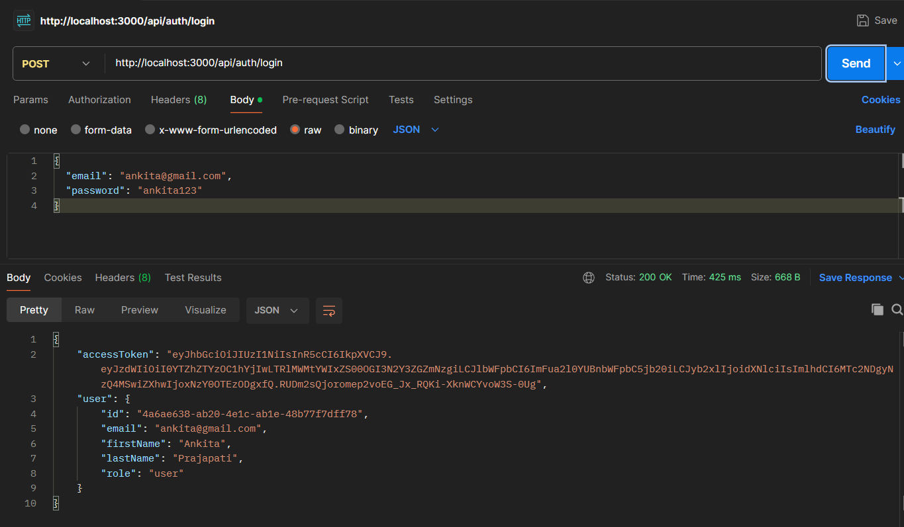
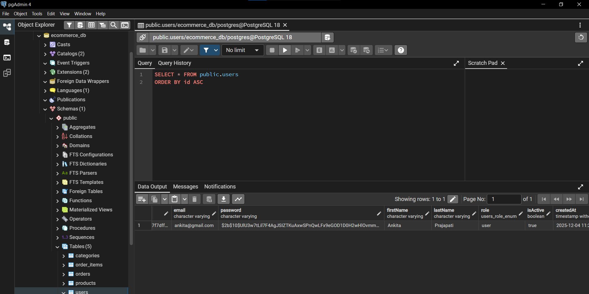

# 🛒 E-commerce API

A complete RESTful E-commerce API built with **NestJS**, **TypeORM**, and **PostgreSQL** as part of the SDE Intern (Backend) Assessment.


---

## 📋 Table of Contents

- [Features](#-features)
- [Tech Stack](#-tech-stack)
- [Project Structure](#-project-structure)
- [Setup Instructions](#-setup-instructions)
- [API Endpoints](#-api-endpoints)
- [Authentication & Authorization](#-authentication--authorization)
- [Input Validation](#-input-validation)
- [Error Handling](#-error-handling)
- [Database Schema](#-database-schema)
- [API Screenshots](#-api-screenshots)
- [Running Tests](#-running-tests)
- [Author](#-author)

---

## ✨ Features

| Feature | Description |
|---------|-------------|
| 🔐 **JWT Authentication** | Secure authentication using JSON Web Tokens |
| 👥 **Role-Based Authorization** | Admin and User roles with protected routes |
| 📦 **CRUD Operations** | Full Create, Read, Update, Delete for all entities |
| ✅ **Input Validation** | Request validation using class-validator |
| 🛡️ **Error Handling** | Global exception filter for consistent error responses |
| 🗄️ **TypeORM Integration** | Database schema management with TypeORM |
| 🧪 **Unit Tests** | Jest-based testing for API verification |
| 📝 **Well-Documented** | Clean, maintainable, and documented code |

---

## 🛠️ Tech Stack

- **Framework**: [NestJS](https://nestjs.com/) - A progressive Node.js framework
- **Database**: [PostgreSQL](https://www.postgresql.org/) - Open source relational database
- **ORM**: [TypeORM](https://typeorm.io/) - ORM for TypeScript and JavaScript
- **Authentication**: [Passport.js](http://www.passportjs.org/) + JWT
- **Validation**: [class-validator](https://github.com/typestack/class-validator) & [class-transformer](https://github.com/typestack/class-transformer)
- **Testing**: [Jest](https://jestjs.io/) - JavaScript Testing Framework
- **Language**: [TypeScript](https://www.typescriptlang.org/)

---

## 📁 Project Structure

```
E-commerce/
├── src/
│   ├── main.ts                    # Application entry point
│   ├── app.module.ts              # Root module
│   │
│   ├── auth/                      # Authentication module
│   │   ├── auth.controller.ts     # Auth routes (login, register)
│   │   ├── auth.service.ts        # Auth business logic
│   │   ├── auth.module.ts         # Auth module definition
│   │   ├── decorators/            # Custom decorators
│   │   │   ├── current-user.decorator.ts
│   │   │   └── roles.decorator.ts
│   │   ├── dto/                   # Data Transfer Objects
│   │   │   ├── login.dto.ts
│   │   │   └── register.dto.ts
│   │   ├── guards/                # Auth guards
│   │   │   ├── jwt-auth.guard.ts
│   │   │   └── roles.guard.ts
│   │   └── strategies/            # Passport strategies
│   │       └── jwt.strategy.ts
│   │
│   ├── users/                     # Users module
│   │   ├── users.controller.ts    # User CRUD routes
│   │   ├── users.service.ts       # User business logic
│   │   ├── users.module.ts        # Users module definition
│   │   ├── dto/                   # User DTOs
│   │   ├── entities/              # User entity
│   │   │   └── user.entity.ts
│   │   └── enums/                 # User enums
│   │       └── user-role.enum.ts
│   │
│   ├── products/                  # Products module
│   │   ├── products.controller.ts # Product CRUD routes
│   │   ├── products.service.ts    # Product business logic
│   │   ├── products.module.ts     # Products module definition
│   │   ├── dto/                   # Product DTOs
│   │   └── entities/              # Product entity
│   │       └── product.entity.ts
│   │
│   ├── categories/                # Categories module
│   │   ├── categories.controller.ts
│   │   ├── categories.service.ts
│   │   ├── categories.module.ts
│   │   ├── dto/
│   │   └── entities/
│   │       └── category.entity.ts
│   │
│   ├── orders/                    # Orders module
│   │   ├── orders.controller.ts   # Order CRUD routes
│   │   ├── orders.service.ts      # Order business logic
│   │   ├── orders.module.ts       # Orders module definition
│   │   ├── dto/                   # Order DTOs
│   │   ├── entities/              # Order entities
│   │   │   ├── order.entity.ts
│   │   │   └── order-item.entity.ts
│   │   └── enums/
│   │       └── order-status.enum.ts
│   │
│   └── common/                    # Shared utilities
│       └── filters/
│           └── http-exception.filter.ts
│
├── test/                          # Test files
├── images/                        # API screenshots
├── .env                           # Environment variables
├── .env.example                   # Environment template
├── package.json                   # Dependencies
├── tsconfig.json                  # TypeScript config
├── nest-cli.json                  # NestJS CLI config
└── jest.config.json               # Jest config
```

---

## 🚀 Setup Instructions

### Prerequisites

- **Node.js** (v18 or higher)
- **PostgreSQL** (v14 or higher)
- **npm** or **yarn**
- **Git**

### Step 1: Clone the Repository

```bash
git clone https://github.com/Ankita0037/E-commerce.git
cd E-commerce
```

### Step 2: Install Dependencies

```bash
npm install
```

### Step 3: Setup PostgreSQL Database

1. Install PostgreSQL from https://www.postgresql.org/download/
2. Open pgAdmin or psql terminal
3. Create a new database:

```sql
CREATE DATABASE ecommerce_db;
```

### Step 4: Configure Environment Variables

Create a `.env` file in the root directory (use `.env.example` as template):

```env
# Database Configuration
DB_HOST=localhost
DB_PORT=5432
DB_USERNAME=postgres
DB_PASSWORD=your_password
DB_DATABASE=ecommerce_db

# JWT Configuration
JWT_SECRET=your-super-secret-jwt-key-change-in-production
JWT_EXPIRATION=24h

# Application
PORT=3000
NODE_ENV=development
```

### Step 5: Run the Application

```bash
# Development mode (with hot reload)
npm run start:dev

# Production mode
npm run build
npm run start:prod
```

The API will be available at `http://localhost:3000/api`

---

## 📡 API Endpoints

### Authentication Endpoints

| Method | Endpoint | Description | Access |
|--------|----------|-------------|--------|
| `POST` | `/api/auth/register` | Register a new user | Public |
| `POST` | `/api/auth/register-admin` | Register an admin user | Public |
| `POST` | `/api/auth/login` | Login and get JWT token | Public |
| `GET` | `/api/auth/profile` | Get current user profile | Protected |

### Users Endpoints (Admin Only)

| Method | Endpoint | Description | Access |
|--------|----------|-------------|--------|
| `GET` | `/api/users` | Get all users | Admin |
| `GET` | `/api/users/:id` | Get user by ID | Admin |
| `PATCH` | `/api/users/:id` | Update user | Admin |
| `DELETE` | `/api/users/:id` | Delete user | Admin |

### Products Endpoints

| Method | Endpoint | Description | Access |
|--------|----------|-------------|--------|
| `GET` | `/api/products` | Get all products | Public |
| `GET` | `/api/products/:id` | Get product by ID | Public |
| `POST` | `/api/products` | Create product | Admin |
| `PATCH` | `/api/products/:id` | Update product | Admin |
| `DELETE` | `/api/products/:id` | Delete product | Admin |

### Categories Endpoints

| Method | Endpoint | Description | Access |
|--------|----------|-------------|--------|
| `GET` | `/api/categories` | Get all categories | Public |
| `GET` | `/api/categories/:id` | Get category by ID | Public |
| `POST` | `/api/categories` | Create category | Admin |
| `PATCH` | `/api/categories/:id` | Update category | Admin |
| `DELETE` | `/api/categories/:id` | Delete category | Admin |

### Orders Endpoints

| Method | Endpoint | Description | Access |
|--------|----------|-------------|--------|
| `GET` | `/api/orders` | Get all orders | Protected |
| `GET` | `/api/orders/:id` | Get order by ID | Protected |
| `POST` | `/api/orders` | Create new order | Protected |
| `PATCH` | `/api/orders/:id` | Update order status | Admin |
| `DELETE` | `/api/orders/:id` | Cancel order | Protected |

---

## 🔐 Authentication & Authorization

### JWT Authentication Flow

1. **Register** - Create a new account
2. **Login** - Get JWT access token
3. **Use Token** - Include in Authorization header for protected routes

### Using JWT Token

Add the token to the `Authorization` header:

```
Authorization: Bearer <your-jwt-token>
```

### Role-Based Access Control

| Role | Permissions |
|------|-------------|
| **User** | View products, Create orders, View own orders |
| **Admin** | All user permissions + Manage products, categories, users, all orders |

---

## ✅ Input Validation

All API inputs are validated using `class-validator`. Example validations:

### Register DTO
```typescript
{
  "email": "user@example.com",     // Must be valid email
  "password": "password123",        // Min 8 characters
  "firstName": "John",              // Min 2 characters
  "lastName": "Doe"                 // Min 2 characters
}
```

### Create Product DTO
```typescript
{
  "name": "iPhone 15",              // Min 2 characters
  "description": "Latest smartphone", // Min 10 characters
  "price": 999.99,                  // Must be positive number
  "stock": 50                       // Must be non-negative
}
```

### Validation Error Response
```json
{
  "success": false,
  "statusCode": 400,
  "error": "Bad Request",
  "message": "Password must be at least 8 characters long",
  "timestamp": "2025-12-04T10:30:00.000Z"
}
```

---

## 🛡️ Error Handling

The API uses a global exception filter for consistent error responses:

### Error Response Format
```json
{
  "success": false,
  "statusCode": 404,
  "error": "Not Found",
  "message": "Product with ID \"uuid\" not found",
  "timestamp": "2025-12-04T10:30:00.000Z"
}
```

### Common HTTP Status Codes

| Code | Description |
|------|-------------|
| `200` | Success |
| `201` | Created |
| `400` | Bad Request (Validation Error) |
| `401` | Unauthorized |
| `403` | Forbidden |
| `404` | Not Found |
| `409` | Conflict (Duplicate Entry) |
| `500` | Internal Server Error |

---

## 🗄️ Database Schema

### Entity Relationship Diagram

```
┌─────────────┐     ┌─────────────┐     ┌─────────────────┐
│   Users     │     │  Categories │     │    Products     │
├─────────────┤     ├─────────────┤     ├─────────────────┤
│ id (PK)     │     │ id (PK)     │     │ id (PK)         │
│ email       │     │ name        │     │ name            │
│ password    │     │ description │     │ description     │
│ firstName   │     │ isActive    │     │ price           │
│ lastName    │     │ createdAt   │     │ stock           │
│ role        │     │ updatedAt   │     │ categoryId (FK) │
│ isActive    │     └─────────────┘     │ isActive        │
│ createdAt   │                         │ createdAt       │
│ updatedAt   │                         │ updatedAt       │
└─────────────┘                         └─────────────────┘
       │
       │ 1:N
       ▼
┌─────────────┐     ┌─────────────────┐
│   Orders    │     │   OrderItems    │
├─────────────┤     ├─────────────────┤
│ id (PK)     │────▶│ id (PK)         │
│ orderNumber │ 1:N │ orderId (FK)    │
│ userId (FK) │     │ productId (FK)  │
│ status      │     │ quantity        │
│ totalAmount │     │ unitPrice       │
│ shippingAddr│     │ totalPrice      │
│ createdAt   │     │ createdAt       │
│ updatedAt   │     └─────────────────┘
└─────────────┘
```

---

## 📸 API Screenshots

### User Registration


### User Login


### Database View


---

## 🧪 Running Tests

```bash
# Run all unit tests
npm run test

# Run tests with coverage report
npm run test:cov

# Run tests in watch mode
npm run test:watch
```

### Test Coverage

The project includes unit tests for:
- ✅ Authentication Service
- ✅ Users Service
- ✅ Products Service
- ✅ Categories Service
- ✅ Orders Service

---

## 📝 API Usage Examples

### 1. Register a User

```http
POST /api/auth/register
Content-Type: application/json

{
  "email": "ankita@gmail.com",
  "password": "ankita123",
  "firstName": "Ankita",
  "lastName": "Prajapati"
}
```

### 2. Login

```http
POST /api/auth/login
Content-Type: application/json

{
  "email": "ankita@gmail.com",
  "password": "ankita123"
}
```

**Response:**
```json
{
  "accessToken": "eyJhbGciOiJIUzI1NiIsInR5cCI6IkpXVCJ9...",
  "user": {
    "id": "uuid",
    "email": "ankita@gmail.com",
    "firstName": "Ankita",
    "lastName": "Prajapati",
    "role": "user"
  }
}
```

### 3. Create Product (Admin)

```http
POST /api/products
Authorization: Bearer <token>
Content-Type: application/json

{
  "name": "iPhone 15 Pro",
  "description": "Latest Apple smartphone with A17 Pro chip and titanium design",
  "price": 1199.99,
  "stock": 100
}
```

### 4. Create Order

```http
POST /api/orders
Authorization: Bearer <token>
Content-Type: application/json

{
  "items": [
    {
      "productId": "product-uuid",
      "quantity": 2
    }
  ],
  "shippingAddress": "123 Main Street, City, Country - 12345"
}
```

---

## 🔧 Scripts

| Script | Description |
|--------|-------------|
| `npm run start` | Start the application |
| `npm run start:dev` | Start with hot reload |
| `npm run start:prod` | Start in production mode |
| `npm run build` | Build the application |
| `npm run test` | Run unit tests |
| `npm run test:cov` | Run tests with coverage |

---

## ✅ Assignment Checklist

- [x] **NestJS Framework** - Built entirely with NestJS
- [x] **PostgreSQL Database** - Using PostgreSQL for data storage
- [x] **CRUD Endpoints** - Full CRUD for Users, Products, Categories, Orders
- [x] **TypeORM** - Database schema and operations managed with TypeORM
- [x] **Input Validation** - Request validation using class-validator
- [x] **Error Handling** - Global exception filter for consistent responses
- [x] **JWT Authentication** - Secure authentication with JSON Web Tokens
- [x] **Authorization** - Role-based access control (Admin/User)
- [x] **Git & GitHub** - Version controlled and hosted on GitHub
- [x] **Clean Code** - Well-structured, maintainable codebase
- [x] **Documentation** - Comprehensive README with setup instructions
- [x] **Unit Tests** - Jest-based tests for API verification

---

## 👤 Author

**Ankita Prajapati**

- GitHub: [@Ankita0037](https://github.com/Ankita0037)

---

## 📄 License

This project is licensed under the ISC License.

---

<p align="center">Made with ❤️ using NestJS</p>
